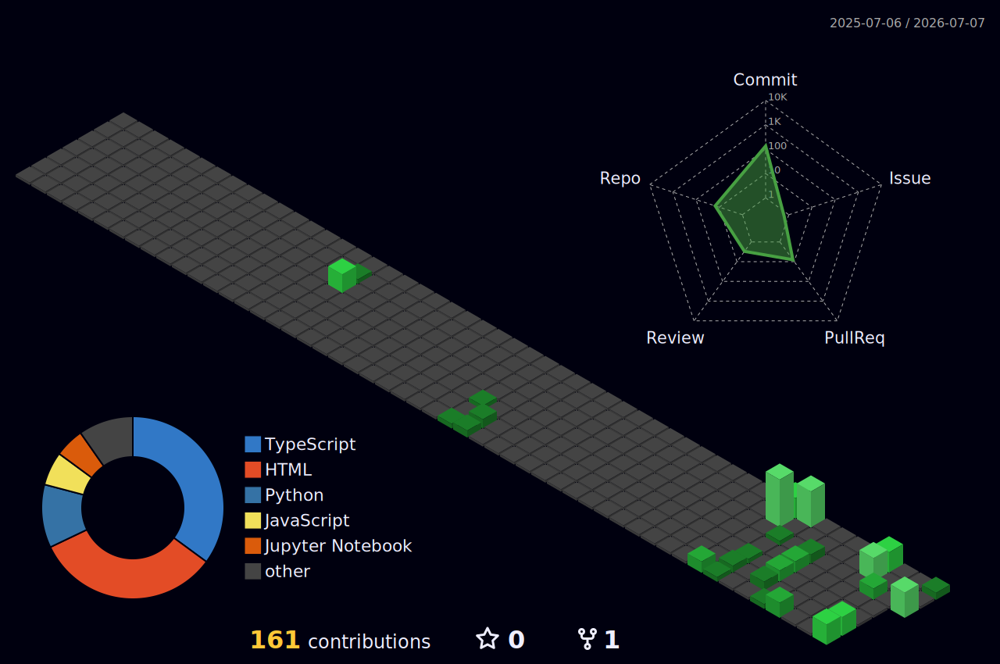

  

---

## 💻 About Me

I'm a software engineer who likes shipping things that actually run — full-stack web apps, machine learning, and automation that does real work.

- 🔭 Currently building ML services (Flask) and full-stack web apps
- 🎓 Working through the **VortexTech AI/ML** program — hands-on notebooks weekly
- ⚡ Automating real workflows — scraping, pipelines, n8n + Docker
- 🧠 Into Machine Learning — match prediction, calibrated probabilities, xG models
- 🚀 Most of my projects are deployed with live demos
- 💼 Open to collaboration and opportunities
- 🌐 Portfolio: [portfolio-mohid.vercel.app](https://portfolio-mohid.vercel.app)

---

## ⭐ LATEST PROJECTS

| 🤝 **NEXUS** | ⚽ **WC26 PREDICTOR** |
|---|---|
| **[Nexus](https://github.com/Mohid59/Nexus)** · [live ↗](https://nexus-eta-puce-37.vercel.app) Investor & entrepreneur collaboration platform. Full-stack TypeScript monorepo with real-time messaging.       | **[WC26 Predictor](https://github.com/Mohid59/WC26-PREDICTOR)** · [live ↗](https://wc-26-predictor.vercel.app) Forecasts FIFA World Cup 2026 results with ML — calibrated win probabilities, expected goals, and full tournament simulations.       |

---

## 🔥 MORE PROJECTS

| 🎯 **[LeadsGenerator](https://github.com/Mohid59/LeadsGenerator)** | 🛒 **[Brandstore](https://github.com/Mohid59/ecommerce-fullstack-design)** | 🦇 **[Gotham Protocol](https://github.com/Mohid59/Gotham-Protocol)** |
|---|---|---|
| Automated Google Maps → no-website leads pipeline. Finds businesses that need a site and drops them into Sheets. | Full eCommerce marketplace — cart, checkout, reviews, and a role-protected admin panel. [live ↗](https://ecommerce-fullstack-design-sand-seven.vercel.app) | Batman-themed tactical HUD showcase site, heavy on animation. [live ↗](https://gotham-protocol.vercel.app) |
|    |   |   |

| 🍽 **[DineDesign](https://github.com/Mohid59/DineDesign)** | ✉️ **[MailForge](https://github.com/Mohid59/MailForge)** | 🏫 **[Classroom Reservation](https://github.com/Mohid59/Classroom-Reservation-System)** |
|---|---|---|
| Restaurant / menu design web app. [live ↗](https://dinedesign-3.onrender.com) | Email builder for crafting and previewing templates. [live ↗](https://mail-forge-pied.vercel.app) | Java Swing desktop app for booking university rooms without clashes. |
|   |   |   |

| 🎉 **[Smart Campus Portal](https://github.com/Mohid59/smart-campus-event-portal)** | 🏥 **[Ai-Clinic](https://github.com/Mohid59/Ai-Clinic)** | 🧑‍💻 **[Portfolio](https://github.com/Mohid59/Portfolio)** |
|---|---|---|
| Campus event management portal for students and organizers. | AI-assisted clinic / healthcare helper. | My personal portfolio site. [live ↗](https://portfolio-mohid.vercel.app) |
|   |  |   |

| 🧪 **[ML Services Hub](https://github.com/Mohid59/ml-services-hub)** | 📓 **[VortexTech AI/ML](https://github.com/Mohid59/vortextech-aiml-week2)** | |
|---|---|---|
| Nine machine-learning services behind a single Flask UI. | Weekly AI/ML coursework — notebooks on data prep, models, and evaluation. | |
|    |   | |

> 👉 See pinned repos below for live demos and code!

---

## 🏆 HIGHLIGHTS

| 🌐 Full-Stack Web | 🧠 Machine Learning | ⚙️ Automation | ⚡ Real-Time Apps |
|---|---|---|---|
| React + Next.js + Node | Prediction & xG models | Scraping & n8n pipelines | Socket.IO messaging |

---

## 📊 GITHUB STATS

<!-- stats-cachebust -->

  

  
  

  
  

<!-- /stats-cachebust -->

---

## 🧊 3D CONTRIBUTIONS

---

## 🐍 CONTRIBUTION SNAKE

---

## 🛠 TECH STACK

**Languages**

**Frameworks & Libraries**

**Databases & Backend Services**

**Developer Tools**

---

## 📫 CONNECT WITH ME

  
  
  
  

---

  <i>"I care more about things that run than things that just compile."</i>

  

